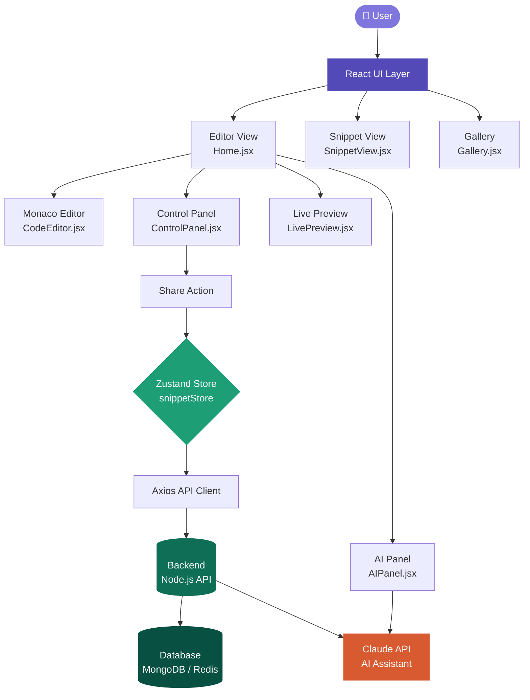
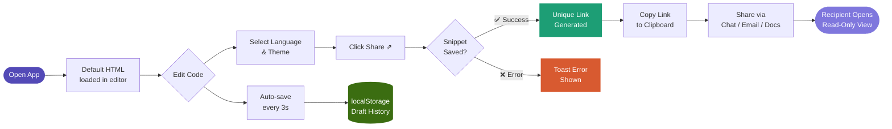
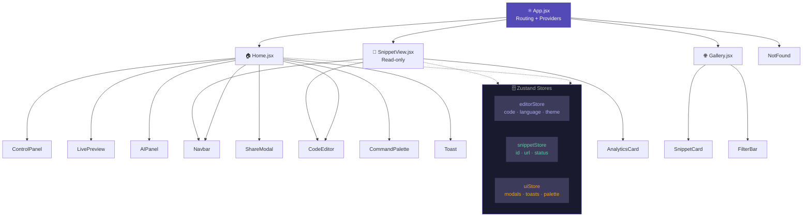
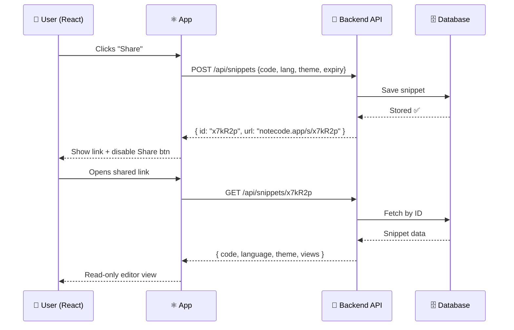

<div align="center">


<br/>

[](https://reactjs.org/)
[](https://microsoft.github.io/monaco-editor/)
[](https://tailwindcss.com/)
[](https://zustand-demo.pmnd.rs/)

[](https://opensource.org/licenses/MIT)
[](http://makeapullrequest.com)
[](https://vercel.com)
[]()

<br/>

> **NoteCode** is a lightning-fast, developer-friendly code sharing platform.  
> Write beautiful code, pick your theme, and share it with the world — in seconds.

<br/>

**[🚀 Live Demo](https://notecode.app)** · **[📖 Docs](https://notecode.app/docs)** · **[🐛 Report Bug](https://github.com/yourusername/notecode/issues)** · **[✨ Request Feature](https://github.com/yourusername/notecode/issues)**

</div>

---

## 📸 Preview

<div align="center">

```
╔══════════════════════════════════════════════════════════════════════╗
║  🌙 NoteCode  [HTML ▾]  [VS Dark ▾]       [Share ⇗]  [Copy 📋]     ║
╠══════════════════════════════════════════════════════════════════════╣
║  1  │  <!DOCTYPE html>                    ║  LIVE PREVIEW           ║
║  2  │  <html lang="en">                   ║ ┌─────────────────────┐ ║
║  3  │    <head>                           ║ │                     │ ║
║  4  │      <title>Hello World</title>     ║ │   Hello, World! 👋  │ ║
║  5  │    </head>                          ║ │                     │ ║
║  6  │    <body>                           ║ └─────────────────────┘ ║
║  7  │      <h1>Hello, World!</h1>         ║                         ║
║  8  │    </body>                          ║  📊 Views: 142          ║
║  9  │  </html>                            ║  🕐 Expires: 7 days     ║
╚══════════════════════════════════════════════════════════════════════╝
```

</div>

---

## ✨ Features

<div align="center">

| 🎯 Feature | 📝 Description |
|-----------|---------------|
| ⚡ **Monaco Editor** | Full VS Code experience — syntax highlight, IntelliSense, multi-cursor |
| 🎨 **10+ Themes** | VS Dark, Dracula, Monokai, GitHub Light & more. Saved to localStorage |
| 🔗 **Instant Share** | Unique nanoid link generated in `<200ms`. One click to copy |
| 👁️ **Live Preview** | Real-time HTML/CSS/JS output in a split-panel view |
| 🤖 **AI Assistant** | Claude-powered inline AI to explain, refactor, or generate code |
| 👥 **Live Collab** | Real-time cursor presence via Yjs + WebSocket |
| 🔒 **Privacy Control** | Public / Unlisted snippets + expiry (1h / 24h / 7d / forever) |
| 📊 **Analytics** | Per-snippet view count, unique visitors, last accessed |
| 🌐 **Public Gallery** | Browse, filter, star & fork community snippets |
| ⌨️ **Command Palette** | `Cmd+K` for everything — share, fork, change language, themes |
| 📋 **Embed Widget** | Generate `<iframe>` embed code for any snippet |
| 💾 **Auto-Save** | Drafts auto-saved every 3s with full version history |

</div>

---

## 🏗️ System Architecture



---

## 🔄 User Flow



---

## 🧩 Component Architecture



---

## 📁 Project Structure

```
notecode/
├── 📂 public/
│   └── favicon.svg
├── 📂 src/
│   ├── 📂 components/
│   │   ├── Navbar.jsx            ← Top bar with branding + actions
│   │   ├── ControlPanel.jsx      ← Language / theme dropdowns
│   │   ├── CodeEditor.jsx        ← Monaco editor wrapper
│   │   ├── LivePreview.jsx       ← Real-time HTML output panel
│   │   ├── ShareModal.jsx        ← Link generation + copy UI
│   │   ├── AIPanel.jsx           ← Claude API chat sidebar
│   │   ├── CommandPalette.jsx    ← Cmd+K overlay
│   │   ├── Toast.jsx             ← Notification system
│   │   ├── SnippetCard.jsx       ← Gallery snippet card
│   │   └── FilterBar.jsx         ← Gallery filters
│   │
│   ├── 📂 pages/
│   │   ├── Home.jsx              ← Editor + share page
│   │   ├── SnippetView.jsx       ← Read-only shared snippet
│   │   ├── Gallery.jsx           ← Public snippet browser
│   │   └── NotFound.jsx          ← 404 page
│   │
│   ├── 📂 store/
│   │   ├── editorStore.js        ← code, language, theme state
│   │   ├── snippetStore.js       ← snippet ID, URL, status
│   │   └── uiStore.js            ← modals, toasts, palette
│   │
│   ├── 📂 hooks/
│   │   ├── useAutoSave.js        ← 3s debounce + history
│   │   ├── useShare.js           ← POST snippet + get link
│   │   ├── useKeyboard.js        ← Cmd+K and shortcut map
│   │   └── useCollaboration.js   ← Yjs + WebSocket sync
│   │
│   ├── 📂 utils/
│   │   ├── api.js                ← Axios instance + endpoints
│   │   ├── themes.js             ← Monaco theme configs
│   │   ├── languages.js          ← Language definitions
│   │   └── generateId.js         ← nanoid wrapper
│   │
│   ├── App.jsx
│   └── main.jsx
│
├── .env.example
├── tailwind.config.js
├── vite.config.js
└── package.json
```

---

## 🔌 API Reference



---

## 🚀 Getting Started

### Prerequisites

```bash
node >= 18.x
npm >= 9.x
```

### Installation

```bash
# 1. Clone the repository
git clone https://github.com/yourusername/notecode.git

# 2. Navigate to project directory
cd notecode

# 3. Install dependencies
npm install

# 4. Set up environment variables
cp .env.example .env
```

### Environment Variables

```env
VITE_API_BASE_URL=http://localhost:5000
VITE_ANTHROPIC_API_KEY=your_claude_api_key_here
VITE_APP_URL=http://localhost:5173
```

### Run Development Server

```bash
npm run dev
```

> App will be live at **http://localhost:5173** 🎉

### Build for Production

```bash
npm run build
npm run preview
```

---

## ⌨️ Keyboard Shortcuts

| Shortcut | Action |
|----------|--------|
| `Cmd + K` | Open Command Palette |
| `Cmd + S` | Save / Share snippet |
| `Cmd + Shift + C` | Copy share link |
| `Cmd + Shift + P` | Toggle Live Preview |
| `Cmd + Shift + A` | Open AI Assistant |
| `Cmd + /` | Toggle line comment |
| `Cmd + Z` | Undo |
| `Cmd + Shift + Z` | Redo |

---

## 🛠️ Tech Stack

<div align="center">

| Layer | Technology |
|-------|-----------|
| **Framework** | React 18 + Vite |
| **Editor** | Monaco Editor |
| **Styling** | Tailwind CSS |
| **State** | Zustand |
| **Animation** | Framer Motion |
| **Routing** | React Router v6 |
| **HTTP** | Axios |
| **IDs** | nanoid |
| **Collab** | Yjs + WebSocket |
| **AI** | Claude API (Anthropic) |
| **Deploy** | Vercel |

</div>

---

## 🤝 Contributing

Contributions are what make the open source community amazing. Any contributions you make are **greatly appreciated**!

```bash
# 1. Fork the Project
# 2. Create your Feature Branch
git checkout -b feature/AmazingFeature

# 3. Commit your Changes
git commit -m 'feat: add AmazingFeature'

# 4. Push to the Branch
git push origin feature/AmazingFeature

# 5. Open a Pull Request
``
<div align="center">

### ⭐ Star this repo if you found it useful!

<br/>

**Built with ❤️ by developers, for developers.**

<br/>


</div>
